<div align="center">

<!-- Dynamic Typing SVG -->


<!-- Animated Wave -->


</div>

---

### 🎭 About Me

```typescript
const oscaner = {
    role: "Solution Architect & Full Stack Developer",
    location: "🌏 Somewhere in the Cloud",
    experience: "5+ years turning coffee into code",
    passion: ["Clean Architecture", "Cloud Native", "DevOps Culture"],
    currentFocus: "Building scalable systems that don't wake me up at 3 AM",
    lifePhilosophy: "Code with purpose, architect with vision, deploy with confidence"
};
```

<div align="center">

### 💻 Tech Arsenal

<!-- Programming Languages -->

<br/>

<!-- Frameworks & Libraries -->

<br/>

<!-- DevOps & Cloud -->

<br/>

<!-- Tools -->


</div>

---

<div align="center">

### 📊 GitHub Analytics


</div>

<div align="center">

### 🏆 GitHub Trophies


</div>

---

<div align="center">

### 🔥 Contribution Streak


</div>

---

### 🎯 Current Mission

```mermaid
graph LR
    A[💡 Ideate] --> B[🏗️ Architect]
    B --> C[💻 Code]
    C --> D[🧪 Test]
    D --> E[🚀 Deploy]
    E --> F[📈 Monitor]
    F --> A
    style A fill:#A855F7,stroke:#fff,stroke-width:2px,color:#fff
    style E fill:#A855F7,stroke:#fff,stroke-width:2px,color:#fff
```



---

<div align="center">

### 🌐 Connect With Me

[](#oscaner1997)
[](https://www.oscaner.com)
[](mailto:oscaner1997@163.com)
[](#予念以安)
[](https://www.xiaohongshu.com/user/profile/5b54017ae8ac2b0b18e891a4)

<br/>

### 💬 Random Dev Quote


<br/>

---


<br/>


**💜 "In code we trust, in cloud we scale, in automation we excel"**

</div>
